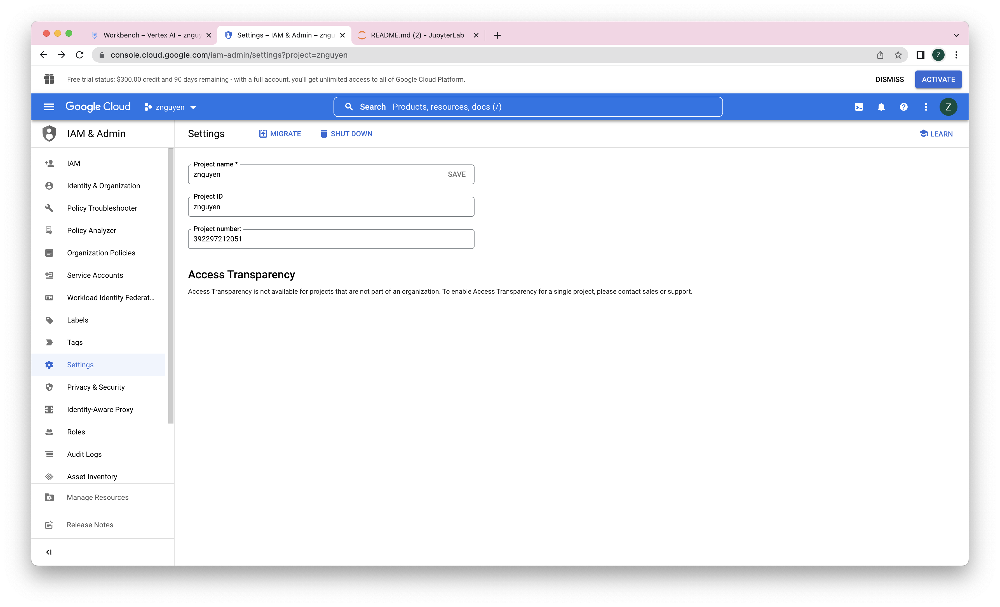
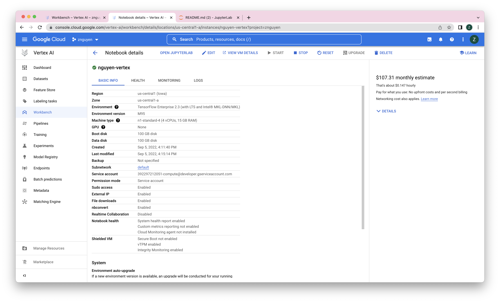
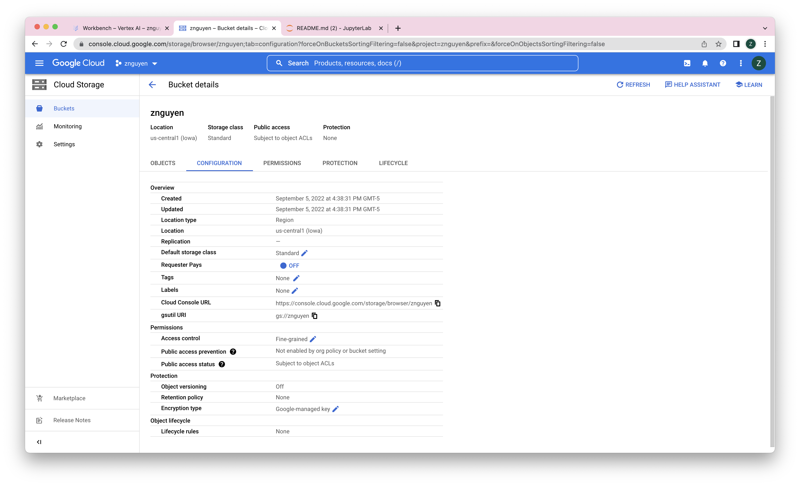
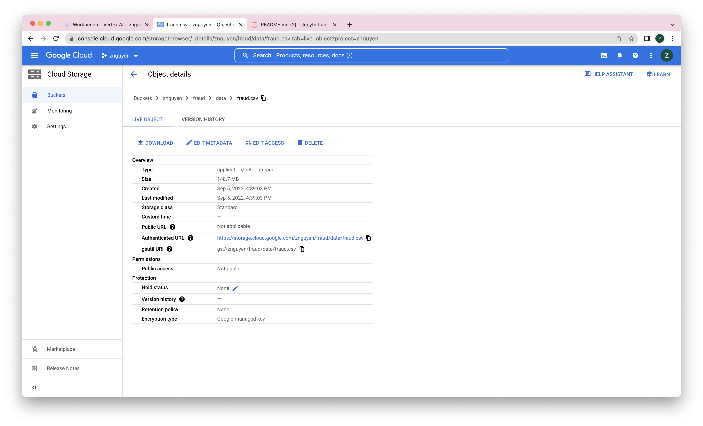

# Vertex AI Enviroment Setup 
## Creat New GCP project

## Create New Notebook in Vertex AI Workbench
* Tensorflow Enterprise > `Tensorflow Enterprise 2.3 > Without GPUs`
* Provide: name, `region = us-central1`, `machine type = n1-standard-4`

---
## Set Up
* `PROJECT_ID = 'znguyen'`
* `REGION = 'us-central1'`
* `DATANAME = 'fraud'`
* `BQ_SOURCE = 'bigquery-public-data.ml_datasets.ulb_fraud_detection'`
* `BUCKET = PROJECT_ID= 'znguyen'`

---
## Create Storage Bucket

---
## Store Project Data in the Storage Bucket
- export from bigquery table to GCS bucket as CSV
    - the table is referenced in the `BQ_SOURCE` variable at the top of this notebook

