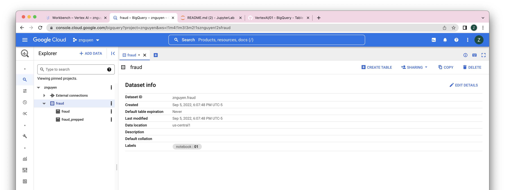
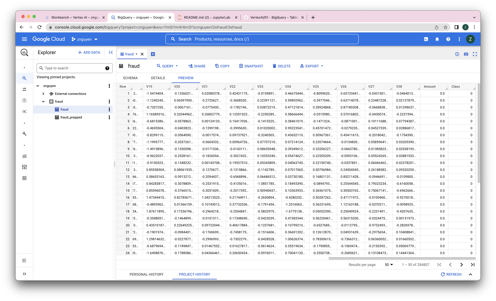
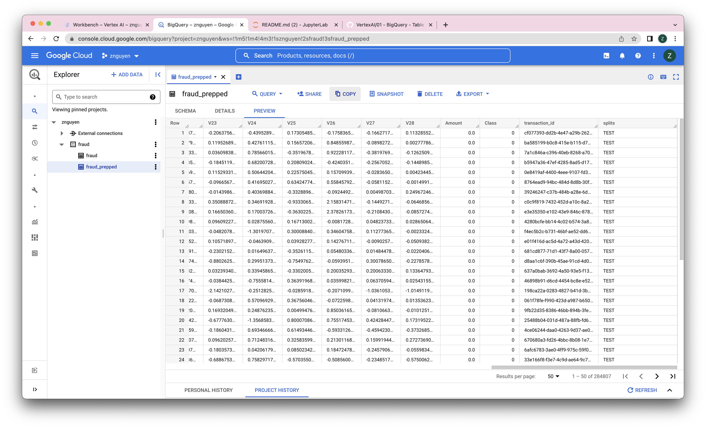

# 01 - BigQuery - Table Data Source
Use BigQuery to load and prepare data for machine learning:

### Prerequisites:
-  00 - Environment Setup
---
## Source Data 

**The Data**

* The source data is exported to Google Cloud Storage in CSV format by the `00 - Environment Setup` notebook.  
* The BigQuery source table is `bigquery-public-data.ml_datasets.ulb_fraud_detection`.  
* This is a table of credit card transactions that are classified as fradulant, `Class = 1`, or normal `Class = 0`.  

The data can be researched further at this [Kaggle link](https://www.kaggle.com/mlg-ulb/creditcardfraud).

**Description of the Data**

* This is a table of 284,207 credit card transactions classified as fradulant or normal in the column `Class`.  
* In order protect confidentiality, the original features have been transformed using principle component analysis (PCA)into 28 features named: `V1, V2, ... V28` (float).  
* Two descriptive features are provided without transformation by PCA:
    * `Time` (integer) is the seconds elapsed between the transaction and the earliest transaction in the table
    * `Amount` (float) is the value of the transaction

**Preparation of the Data**

* This notebook adds two columns to the source data and stores it in a new table with suffix `_prepped`.  
    * `transaction_id` (string) a unique id for the row/transaction
    * `splits` (string) this divided the tranactions into sets for `TRAIN` (80%), `VALIDATA` (10%), and `TEST` (10%)


## Set Up
* `PROJECT_ID = 'znguyen'`
* `REGION = 'us-central1'`
* `DATANAME = 'fraud'`
* `BQ_SOURCE = 'bigquery-public-data.ml_datasets.ulb_fraud_detection'`
* `BUCKET = PROJECT_ID= 'znguyen'`
* `NOTEBOOK = '01'`

## Create Dataset
``` python
ds = bigquery.Dataset(f"{PROJECT_ID}.{DATANAME}")
ds.location = REGION
ds.labels = {'notebook': f"{NOTEBOOK}"}
ds = bq.create_dataset(dataset = ds, exists_ok = True)
```

## Create Table
```python
destination = bigquery.TableReference.from_string(f"{PROJECT_ID}.{DATANAME}.{DATANAME}")
job_config = bigquery.LoadJobConfig(
    write_disposition = 'WRITE_TRUNCATE',
    source_format = bigquery.SourceFormat.CSV,
    autodetect = True,
    labels = {'notebook':f'{NOTEBOOK}'}
)
job = bq.load_table_from_uri(f"gs://{BUCKET}/{DATANAME}/data/{DATANAME}.csv", destination, job_config = job_config)
job.result()
```

## Prepare Data for Analysis
Create a prepped version of the data with test/train splits using SQL DDL:
```sql
CREATE OR REPLACE TABLE `{DATANAME}.{DATANAME}_prepped` AS
WITH add_id AS(SELECT *, GENERATE_UUID() transaction_id FROM `{DATANAME}.{DATANAME}`)
SELECT *,
    CASE 
        WHEN MOD(ABS(FARM_FINGERPRINT(transaction_id)),10) < 8 THEN "TRAIN" 
        WHEN MOD(ABS(FARM_FINGERPRINT(transaction_id)),10) < 9 THEN "VALIDATE"
        ELSE "TEST"
    END AS splits
FROM add_id
```
