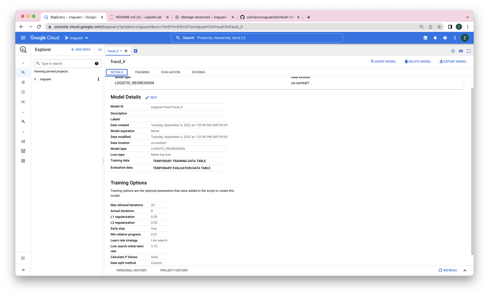
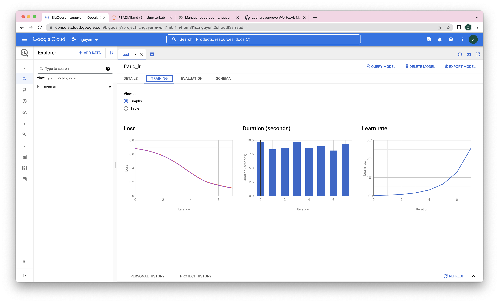
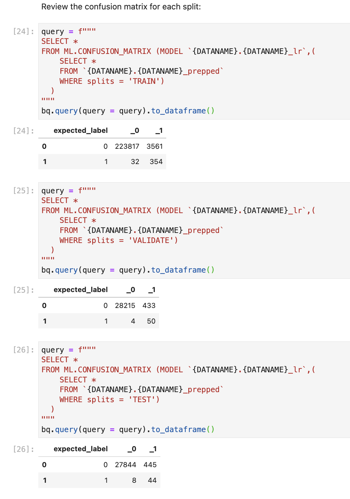
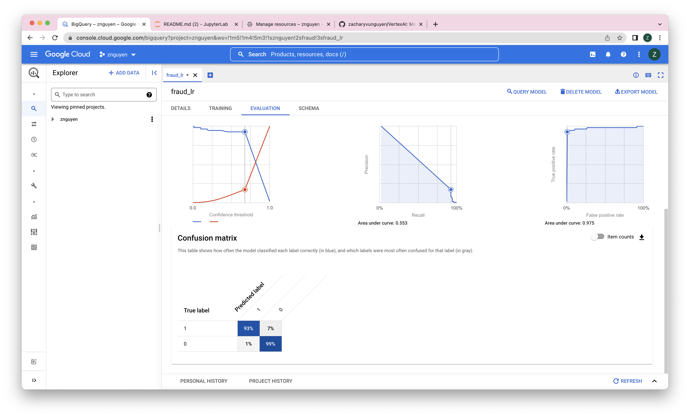

# 02a - BigQuery Machine Learning (BQML) - Machine Learning with SQL
Use BigQuery to load and prepare data for machine learning:

### Prerequisites:
-  01 - BigQuery - Table Data Source
---


## Set Up
* `PROJECT_ID = 'znguyen'`
* `REGION = 'us-central1'`
* `DATANAME = 'fraud'`
* `BQ_SOURCE = 'bigquery-public-data.ml_datasets.ulb_fraud_detection'`
* `BUCKET = PROJECT_ID= 'znguyen'`
* `NOTEBOOK = '02a'`
* `VAR_TARGET = 'Class'`
* `VAR_OMIT = 'transaction_id'`

```python
from google.cloud import bigquery
bq = bigquery.Client()
```

## Train Model
Use BigQuery ML to train multiclass logistic regression model:
- This uses the `splits` column that notebook `01` created
- `data_split_method = CUSTOM` uses the column in `data_split_col` to assign training data for `FALSE` values and evaluation data for `TRUE` values.


```python

query = f"""
CREATE OR REPLACE MODEL `{DATANAME}.{DATANAME}_lr`
OPTIONS
    (model_type = 'LOGISTIC_REG',
        auto_class_weights = TRUE,
        input_label_cols = ['{VAR_TARGET}'],
        data_split_col = 'custom_splits',
        data_split_method = 'CUSTOM'
    ) AS
SELECT * EXCEPT({','.join(VAR_OMIT.split())}, splits),
    CASE
        WHEN splits = 'TRAIN' THEN FALSE
        ELSE TRUE
    END AS custom_splits
FROM `{DATANAME}.{DATANAME}_prepped`
WHERE splits != 'TEST'
"""
job = bq.query(query = query)
job.result()
```
Review the iterations from training:
```python
bq.query(query=f"SELECT * FROM ML.TRAINING_INFO(MODEL `{DATANAME}.{DATANAME}_lr`) ORDER BY iteration").to_dataframe()
```
## Check out this model in BigQuery Console:



## Evaluate Model
* Review the model evaluation statistics on the Test/Train splits:
<table class="dataframe" border="1">
<thead>
<tr>
<th>&nbsp;</th>
<th>SPLIT</th>
<th>precision</th>
<th>recall</th>
<th>accuracy</th>
<th>f1_score</th>
<th>log_loss</th>
<th>roc_auc</th>
</tr>
</thead>
<tbody>
<tr>
<th>0</th>
<td>TEST</td>
<td>0.089980</td>
<td>0.846154</td>
<td>0.984016</td>
<td>0.162662</td>
<td>0.116065</td>
<td>0.962698</td>
</tr>
<tr>
<th>1</th>
<td>TRAIN</td>
<td>0.090421</td>
<td>0.917098</td>
<td>0.984225</td>
<td>0.164613</td>
<td>0.113694</td>
<td>0.988070</td>
</tr>
</tbody>
</table>
* Review the confusion matrix for each split:



* Metrics:

## Prediction


## Explaination
